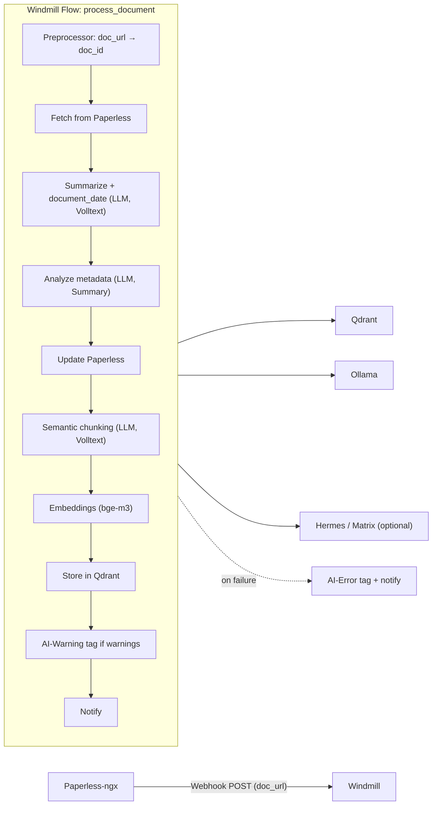

# Paperless-chAIn

AI-Erweiterung für [Paperless-ngx](https://github.com/paperless-ngx/paperless-ngx): automatische Metadaten-Generierung, semantisches Chunking und Vektor-Speicherung in Qdrant — orchestriert mit [Windmill](https://www.windmill.dev/).

## Architektur



### Flow-Schritte

| Schritt | Script | Beschreibung |
|---------|--------|--------------|
| Preprocessor | `preprocess_webhook` | Parst `doc_url` aus dem Paperless-Webhook → `doc_id` |
| fetch | `fetch_document` | OCR-Text, Sprache, bestehende Tags/Typen/Korrespondenten aus Paperless |
| summarize | `summarize_document` | **LLM-Call 1:** Summary + `document_date` aus Volltext (Fallback: Paperless-Hinzufügedatum) |
| analyze | `analyze_document` | **LLM-Call 2:** Titel, Typ, Korrespondent, Tags aus Summary (schnell) |
| update | `update_paperless` | PATCH an Paperless; setzt Inhalts-Tags nach LLM + immer `AI-Processed` |
| chunk | `chunk_document` | **LLM-Call 3:** semantische Chunks aus Volltext + Summary-Chunk fürs Embedding |
| embed | `generate_embeddings` | Vektoren via Ollama/bge-m3 |
| store | `store_qdrant` | Upsert in Qdrant |
| status_tag | `apply_status_tags` | Tag **AI-Warning**, wenn irgendwo Warnings auftraten |
| notify | `notify` | Status/Warnings loggen oder an Matrix/Hermes senden |

Bei Flow-Fehlern: `handle_flow_failure` setzt **AI-Error** und sendet eine Fehler-Benachrichtigung.

Paperless-Workflow-Trigger: **Document Added** (nach OCR und automatischem Matching, siehe [Paperless Workflows](https://docs.paperless-ngx.com/usage/#workflows)).

## Features

- **Trigger**: Paperless-ngx Webhook bei neuem Dokument (`Document Added`)
- **Drei LLM-Calls**: Summary+Datum (Volltext), Metadaten (Summary), Chunking (Volltext)
- **Metadaten**: Titel, Tags, Korrespondent, Dokumenttyp, `created_date` — nur aus bestehenden Paperless-Listen
- **Tag-Bereinigung**: bestehende Inhalts-Tags werden vom LLM geprüft; unpassende können entfernt, passende ergänzt werden
- **System-Tags**: `AI-Warning`, `AI-Error`, `AI-Processed` werden vom LLM ignoriert; `AI-Processed` setzt der Flow bei jedem Update
- **LLM-Chunking**: semantische Teil-Chunks plus separates Summary-Embedding
- **Embeddings**: Ollama/bge-m3 (1024 Dimensionen) in Qdrant
- **Status-Tags**: **AI-Warning** bei Warnings, **AI-Error** bei Flow-Fehler (Tags müssen in Paperless existieren)
- **Search UI**: semantische Suche mit Filterung und Dokument-Gruppierung (FastAPI + HTMX)

## Voraussetzungen

- Docker & Docker Compose
- **Node.js ≥ 20** und **npm** (für die Windmill CLI zum Deployen der Scripts/Flows)
- Paperless-ngx (läuft bereits)
- Ollama mit konfiguriertem LLM (z. B. `qwen2.5:7b`, `qwen3`) und `bge-m3`
- Optional: Hermes Agent oder Matrix für Benachrichtigungen
- In Paperless: Tags **AI-Warning**, **AI-Error** und **AI-Processed** anlegen

## Getting Started

Kurzüberblick — in dieser Reihenfolge einrichten:

| Phase | Was |
|-------|-----|
| Vorbereitung | `.env`, Paperless API-Token, Ollama-Modelle, Status-Tags in Paperless |
| Stack | `docker compose up -d` |
| Windmill | Node/npm, Workspace, API-Token, CLI + `wmill sync push` |
| Paperless | Workflow mit Webhook auf den Windmill-Flow |
| Test | Flow manuell oder per Test-Webhook auslösen |

Details unten in den Setup-Schritten.

## Setup

### 1. Vorbereitung: `.env` und externe Dienste

```bash
cp .env.example .env
```

In `.env` mindestens setzen:

| Variable | Beschreibung |
|----------|--------------|
| `PAPERLESS_URL` | Erreichbare Paperless-URL **vom Windmill-Worker aus** (z. B. `http://host.docker.internal:8010` oder LAN-IP) |
| `PAPERLESS_API_TOKEN` | API-Token aus Paperless → **Settings → API Tokens** |
| `OLLAMA_URL` | Erreichbare Ollama-URL **vom Windmill-Worker aus** (z. B. `http://host.docker.internal:11434`) |
| `OLLAMA_LLM_MODEL` | z. B. `qwen2.5:7b` oder `qwen3` |
| `OLLAMA_EMBED_MODEL` | z. B. `bge-m3` |

**Paperless API-Token:** In Paperless unter **Settings → API Tokens** anlegen, Berechtigung zum Lesen/Schreiben von Dokumenten.

**System-Tags in Paperless anlegen** (exakte Namen):

- `AI-Processed` — wird bei jedem erfolgreichen Update durch den Flow gesetzt
- `AI-Warning` — wird bei erfolgreicher Verarbeitung mit Warnings gesetzt
- `AI-Error` — wird bei Flow-Fehlern gesetzt

**Ollama-Modelle** (auf dem Ollama-Host):

```bash
ollama pull qwen3          # oder das in OLLAMA_LLM_MODEL konfigurierte Modell
ollama pull bge-m3
```

Optional: Benachrichtigungen (`NOTIFY_MODE`, Hermes/Matrix) — siehe Abschnitt [Benachrichtigungen](#benachrichtigungen).

### 2. Stack starten

```bash
docker compose up -d
```

Startet Qdrant, Windmill (Server + Worker + PostgreSQL) und die Search UI.

| Dienst | Standard-URL |
|--------|--------------|
| Windmill UI | `http://localhost:8000` (`WINDMILL_PORT`) |
| Search UI | `http://localhost:8888` (`SEARCH_PORT`) |
| Qdrant | `http://localhost:6333` (`QDRANT_PORT`) |

Stack aktualisieren (git pull, rebuild, neu starten):

```bash
./update-stack.sh
```

Nach `.env`-Änderungen Windmill-Worker neu laden:

```bash
docker compose up -d windmill-worker
```

### 3. Nach dem Stack-Start: Windmill einrichten

`docker compose up` startet nur die Container — **Scripts und Flows sind noch nicht in Windmill**, bis du sie pushst.

#### 3.1 Windmill UI: ersten Zugang

1. **Windmill UI** öffnen: `http://localhost:8000` (oder `WINDMILL_BASE_URL`)
2. Beim **ersten Start** Admin-Benutzer anlegen (E-Mail + Passwort)
3. **Workspace** anlegen oder bestehenden wählen — typisch `main`  
   Die Workspace-ID steckt später in der Webhook-URL: `/api/w/<workspace>/...`

#### 3.2 API-Token für Webhook und CLI

1. In Windmill: **User-Menü → Account Settings** (oder Workspace Settings)
2. **Tokens → Add token** — Token mit Ablaufdatum oder ohne erstellen
3. Token sicher speichern — wird für CLI und Paperless-Webhook-URL benötigt

#### 3.3 Windmill CLI installieren und Scripts deployen

Voraussetzung: **Node.js ≥ 20** (prüfen mit `node --version`). Node/npm installieren z. B. via [nodejs.org](https://nodejs.org/) oder deinem Paketmanager (`apt`, `nvm`, …).

CLI installieren ([offizielle Doku](https://www.windmill.dev/docs/advanced/cli/installation)):

```bash
npm install -g windmill-cli
wmill --version
```

Später aktualisieren: `wmill upgrade`

Im **Projekt-Root** (wo `wmill.yaml` liegt) in `.env` setzen:

```bash
WMILL_BASE_URL=http://localhost:8000   # optional: fällt auf WINDMILL_BASE_URL zurück
WMILL_WORKSPACE=main
WMILL_TOKEN=wm_xxxxxxxx               # API-Token aus 3.2
```

Scripts/Flow deployen:

```bash
./wmill-sync.sh
```

Optional Dry-Run: `./wmill-sync.sh --dry-run`

Manuell (ohne Script):

```bash
wmill sync push \
  --base-url "$WMILL_BASE_URL" \
  --workspace "$WMILL_WORKSPACE" \
  --token "$WMILL_TOKEN" \
  --yes
```

`--yes` überspringt Bestätigungs-Prompts.

**Optional (wiederholtes Deployen):** Workspace einmal lokal registrieren, danach reicht `wmill sync push --yes` (mit gespeichertem Profil, ohne Args):

```bash
wmill workspace add paperless_chain main http://localhost:8000
# fragt interaktiv nach dem Token

wmill sync push --yes
```

Das lädt alle Scripts unter `f/paperless_chain/` und den Flow `f/paperless_chain/process_document` in den Workspace.

**Prüfen in der UI:** **Flows → `f/paperless_chain/process_document`** sollte sichtbar sein; unter **Scripts** die einzelnen Schritte (`fetch_document`, `summarize_document`, …).

#### 3.4 Flow testen (ohne Paperless)

```bash
wmill flow run f/paperless_chain/process_document \
  --base-url "$WMILL_BASE_URL" \
  --workspace "$WMILL_WORKSPACE" \
  --token "$WMILL_TOKEN" \
  -d '{"doc_id": 1}'
```

Ersetze `1` durch eine echte Paperless-Dokument-ID. Logs im Windmill-Worker:

```bash
docker compose logs -f windmill-worker
```

### 4. Paperless-Workflow (Webhook → Windmill)

In Paperless unter **Settings → Workflows** einen neuen Workflow anlegen:

| Feld | Wert |
|------|------|
| Name | Paperless-chAIn Auto-Process |
| Trigger | **Document Added** |
| Action | **Webhook** |
| Method | POST |
| URL | siehe unten |
| Content-Type | `application/json` |
| Body | `{"doc_url": "{{ doc_url }}"}` |

**Webhook-URL** (Platzhalter ersetzen):

```
http://<windmill-host>:<WINDMILL_PORT>/api/w/<workspace>/jobs/run/f/f/paperless_chain/process_document?token=<API-TOKEN>
```

Beispiel lokal, Workspace `main`, Port `8000`:

```
http://localhost:8000/api/w/main/jobs/run/f/f/paperless_chain/process_document?token=wm_xxxxxxxx
```

**Netzwerk:** Paperless muss Windmill unter dieser URL erreichen können. Läuft Paperless in Docker und Windmill auf dem Host (oder umgekehrt), `localhost` funktioniert **nicht** — stattdessen Host-IP, Docker-Bridge-IP oder `host.docker.internal` (Linux/WSL je nach Setup).

**Was Paperless sendet:** JSON mit `doc_url` (z. B. `http://paperless/documents/42/`). Der Flow-Preprocessor parst daraus die `doc_id`.

**Webhook testen** (ohne neues Dokument):

```bash
curl -X POST \
  'http://localhost:8000/api/w/main/jobs/run/f/f/paperless_chain/process_document?token=DEIN_TOKEN' \
  -H 'Content-Type: application/json' \
  -d '{"doc_url": "http://paperless/documents/42/"}'
```

Die `doc_url` muss nicht erreichbar sein — nur die Dokument-ID im Pfad zählt.

### 5. Checkliste: Alles erledigt?

- [ ] Node.js ≥ 20 + `windmill-cli` installiert (`wmill --version`)
- [ ] `.env` mit `WMILL_*`, `PAPERLESS_*`, `OLLAMA_*` gesetzt; Worker neu gestartet falls nötig
- [ ] Ollama-Modelle gepullt
- [ ] Tags `AI-Processed`, `AI-Warning` und `AI-Error` in Paperless angelegt
- [ ] Windmill Admin + Workspace erstellt, API-Token in `WMILL_TOKEN`
- [ ] `./wmill-sync.sh` erfolgreich
- [ ] Flow-Test mit `wmill flow run …` oder curl-Webhook OK
- [ ] Paperless-Workflow **Document Added → Webhook** aktiv
- [ ] Search UI unter `:8888` erreichbar (nach erstem verarbeiteten Dokument sinnvolle Treffer)
- [ ] Optional: `NOTIFY_MODE` / Hermes / Matrix konfiguriert

## Search UI

Semantische Suche über die in Qdrant gespeicherten Dokument-Chunks. Erreichbar unter `http://localhost:8888`.

- Suchanfrage wird via Ollama/bge-m3 in einen Embedding-Vektor umgewandelt
- Qdrant liefert die ähnlichsten Chunks, gruppiert nach Dokument
- Optionale Filter: Korrespondent, Tag, Chunk-Typ (Summary / Teil-Chunks)
- Ergebnisse verlinken direkt auf das Paperless-Dokument

Port konfigurierbar via `SEARCH_PORT` in `.env` (Standard: `8888`).

## Projektstruktur

```
f/paperless_chain/
├── process_document.flow/   # Haupt-Flow
├── preprocess_webhook.py      # Webhook-Preprocessor (doc_url → doc_id)
├── fetch_document.py
├── summarize_document.py      # LLM: Summary + document_date
├── analyze_document.py        # LLM: Titel, Typ, Korrespondent, Tags
├── update_paperless.py
├── chunk_document.py          # LLM: semantisches Chunking
├── generate_embeddings.py
├── store_qdrant.py
├── apply_status_tags.py       # AI-Warning bei Warnings
├── handle_flow_failure.py     # AI-Error bei Flow-Fehler
├── notify.py
└── shared/                    # Ollama-, Paperless-, Notify-Client, Prompts
    ├── ollama_client.py
    ├── paperless_client.py
    ├── notify_client.py
    ├── prompts.py
    └── text_utils.py

search/                        # Search UI (FastAPI + HTMX)
update-stack.sh                # git pull + docker compose down/up --build
wmill-sync.sh                  # wmill sync push aus .env
```

## Chunk-Struktur in Qdrant

```json
{
  "vector": [0.1, 0.2, "..."],
  "payload": {
    "doc_id": 123,
    "chunk_kind": "chunk",
    "label": "Rechnungspositionen",
    "correspondent": "Telekom",
    "tags": ["rechnung"],
    "text": "...",
    "document_type": "Rechnung"
  }
}
```

Zusätzlich ein Chunk mit `"chunk_kind": "summary"` pro Dokument.

## Benachrichtigungen

`NOTIFY_MODE` in `.env`:

| Modus | Beschreibung |
|-------|--------------|
| `log` | Nur Windmill-Logs (Standard) |
| `matrix` | Direkt an Matrix-Room (ohne Hermes) |
| `hermes` | HTTP POST an Hermes-Webhook → Matrix/Telegram/etc. |

### Hermes-Webhook einrichten (`NOTIFY_MODE=hermes`)

Voraussetzungen:
- Hermes Gateway läuft mit Webhook-Adapter (`WEBHOOK_ENABLED=true`, Port standardmäßig `8644`)
- Matrix (oder anderes Ziel) ist in Hermes bereits konfiguriert

**1. Webhook-Route anlegen** (auf dem Hermes-Host):

```bash
hermes webhook subscribe paperless-chain \
  --deliver matrix \
  --deliver-only \
  --prompt "{message}" \
  --description "Paperless-chAIn Dokumenten-Benachrichtigungen"
```

Der Befehl gibt **URL** und **Secret** aus. Beispiel-URL:
`http://192.168.178.158:8644/webhooks/paperless-chain`

**2. In `.env` eintragen:**

```bash
NOTIFY_MODE=hermes
HERMES_WEBHOOK_URL=http://192.168.178.158:8644/webhooks/paperless-chain
HERMES_WEBHOOK_SECRET=<secret-aus-dem-subscribe-befehl>
```

**3. Testen:**

```bash
hermes webhook test paperless-chain --payload '{"message":"Test von Paperless-chAIn","doc_id":1,"event":"paperless_chain.document_processed"}'
```

Windmill-Worker nach `.env`-Änderung neu starten: `docker compose up -d windmill-worker`

### Alternative ohne Hermes-Webhook

- `NOTIFY_MODE=matrix` — Windmill sendet direkt an die Matrix-API (`MATRIX_*` in `.env`)
- `NOTIFY_MODE=log` — nur Logging, kein externer Dienst nötig

## Entwicklung

Einzelne Scripts in Windmill manuell testen (mit denselben `--base-url`, `--workspace`, `--token` wie beim Deploy):

```bash
wmill script run f/paperless_chain/fetch_document \
  --base-url "$WMILL_BASE_URL" \
  --workspace "$WMILL_WORKSPACE" \
  --token "$WMILL_TOKEN" \
  -d '{"doc_id": 1}'

wmill flow run f/paperless_chain/process_document \
  --base-url "$WMILL_BASE_URL" \
  --workspace "$WMILL_WORKSPACE" \
  --token "$WMILL_TOKEN" \
  -d '{"doc_id": 1}'
```

LLM-Requests und Paperless-PATCHs werden im Windmill-Worker-Log ausgegeben (`=== Paperless-chAIn LLM Request ===`, `=== Paperless-chAIn Paperless PATCH ===`).
