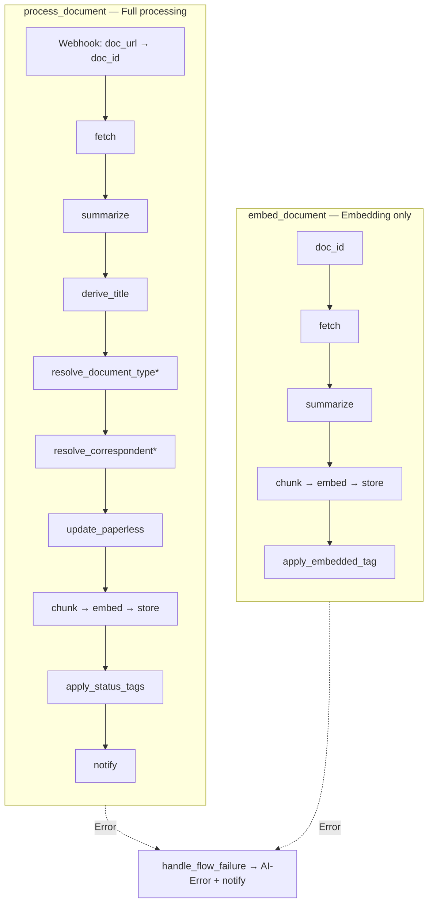

# Flows

Two Windmill flows cover the main use cases. Both use Ollama (LLM + bge-m3) and store vectors in Qdrant.

## Overview



\* Step is skipped when the value is already set in Paperless.

## `process_document`

**Trigger:** Paperless webhook on **Document Added** (after OCR and automatic matching).

**Purpose:** Generate metadata via LLM, update Paperless, embed chunks, and store in Qdrant.

| Step | Script | Description |
|------|--------|-------------|
| Preprocessor | `preprocess_webhook` | Parses `doc_url` → `doc_id` |
| fetch | `fetch_document` | OCR text, language, existing tags/types/correspondents |
| summarize | `summarize_document` | **LLM 1:** Summary + `document_date` from full text |
| derive_title | `derive_title` | **LLM 2:** Title from summary |
| resolve_document_type | `resolve_document_type` | **LLM 3:** Document type (skip if set) |
| resolve_correspondent | `resolve_correspondent` | **LLM 4:** Correspondent (skip if set) |
| update | `update_paperless` | PATCH Paperless; sets `AI-Processed` |
| chunk | `chunk_document` | **LLM 5:** Semantic chunks + summary chunk |
| embed | `generate_embeddings` | Vectors via Ollama/bge-m3 |
| store | `store_qdrant` | Upsert into Qdrant |
| status_tag | `apply_status_tags` | `AI-Warning` on warnings |
| notify | `notify` | Log or send status/warnings |

**On errors:** `handle_flow_failure` sets `AI-Error` and sends an error notification.

### LLM behavior

- Summary + date from **full text**; fallback for date: Paperless added date
- Title, document type, correspondent from **summary**
- Chunking from **full text** + summary chunk for embedding
- Metadata only from existing Paperless lists (type/correspondent may be created new)
- Content tags: LLM checks existing tags, may remove unsuitable ones and add suitable ones
- System tags (`AI-Warning`, `AI-Error`, `AI-Processed`, `AI-Embedded`) are ignored by the LLM

### Start manually

```bash
wmill flow run f/paperless_chain/process_document \
  --base-url "$WMILL_BASE_URL" \
  --workspace "$WMILL_WORKSPACE" \
  --token "$WMILL_TOKEN" \
  -d '{"doc_id": 42}'
```

## `embed_document`

**Trigger:** Manually, via batch queue, or directly with `doc_id`.

**Purpose:** Embedding only — **no** changes to title, tags, correspondent, or document type. Uses existing Paperless metadata for chunk context.

| Step | Script | Description |
|------|--------|-------------|
| fetch | `fetch_document` | Text + existing metadata |
| summarize | `summarize_document` | Summary for summary embedding |
| chunk | `chunk_document` | Semantic chunks (metadata from fetch) |
| embed | `generate_embeddings` | bge-m3 |
| store | `store_qdrant` | Upsert into Qdrant |
| embedded_tag | `apply_embedded_tag` | Sets `AI-Embedded` |

**On errors:** `handle_flow_failure` → `AI-Error`.

### Start manually

```bash
wmill flow run f/paperless_chain/embed_document \
  --base-url "$WMILL_BASE_URL" \
  --workspace "$WMILL_WORKSPACE" \
  --token "$WMILL_TOKEN" \
  -d '{"doc_id": 42}'
```

## Which flow when?

| Scenario | Flow |
|----------|------|
| Automatically process new documents | `process_document` (Paperless webhook) |
| Retroactively add AI metadata to existing docs | `process_document` (batch queue) |
| Update Qdrant only, leave metadata untouched | `embed_document` |
| Re-embed after model change | `embed_document` (batch queue) |

Batch details: [batch-processing.md](batch-processing.md)
