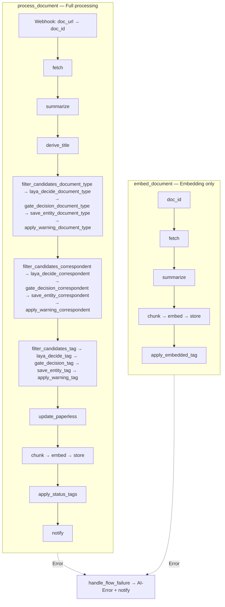

# Flows

Two Windmill flows cover the main use cases. Both use Ollama (LLM + bge-m3) and store vectors in Qdrant.

## Overview


```mermaid
flowchart TB
  subgraph process ["process_document — Full processing"]
    direction TB
    P1["Webhook: doc_url → doc_id"] --> P2["fetch"]
    P2 --> P3["summarize"]
    P3 --> P4["derive_title"]
    P4 --> P5["filter_candidates_document_type → laya_decide_document_type → gate_decision_document_type → save_entity_document_type → apply_warning_document_type"]
    P5 --> P6["filter_candidates_correspondent → laya_decide_correspondent → gate_decision_correspondent → save_entity_correspondent → apply_warning_correspondent"]
    P6 --> P7["filter_candidates_tag → laya_decide_tag → gate_decision_tag → save_entity_tag → apply_warning_tag"]
    P7 --> P8["update_paperless"]
    P8 --> P9["chunk → embed → store"]
    P9 --> P10["apply_status_tags"]
    P10 --> P11["notify"]
  end

  subgraph embed ["embed_document — Embedding only"]
    direction TB
    E1["doc_id"] --> E2["fetch"]
    E2 --> E3["summarize"]
    E3 --> E4["chunk → embed → store"]
    E4 --> E5["apply_embedded_tag"]
  end

  process -.->|"Error"| Fail["handle_flow_failure → AI-Error + notify"]
  embed -.->|"Error"| Fail
```

\* Step is skipped when the value is already set in Paperless.

## `process_document`

**Trigger:** Paperless webhook on **Document Added** (after OCR and automatic matching).

**Purpose:** Generate metadata via LLM, update Paperless, embed chunks, and store in Qdrant.

| Step | Script | Description |
|------|--------|-------------|
| Preprocessor | `preprocess_webhook` | Parses `doc_url` → `doc_id` |
| fetch | `fetch_document` | OCR text, language, existing tags/types/correspondents |
| summarize | `summarize_document` | **LLM 1:** Summary + `document_date` from full text |
| derive_title | `derive_title` | **LLM 2:** Title from summary |
| filter_candidates_document_type | `filter_candidates` | Embedding filter for document type |
| laya_decide_document_type | `laya_decide` | **LLM 3:** Decide document type |
| gate_decision_document_type | `gate_decision` | Confidence gate for document type |
| save_entity_document_type | `save_entity` | Create/find document type in Paperless |
| apply_warning_document_type | `apply_status_tags` | AI-Warning tag if rejected |
| filter_candidates_correspondent | `filter_candidates` | Embedding filter for correspondent |
| laya_decide_correspondent | `laya_decide` | **LLM 4:** Decide correspondent |
| gate_decision_correspondent | `gate_decision` | Confidence gate for correspondent |
| save_entity_correspondent | `save_entity` | Create/find correspondent in Paperless |
| apply_warning_correspondent | `apply_status_tags` | AI-Warning tag if rejected |
| filter_candidates_tag | `filter_candidates` | Embedding filter for tags |
| laya_decide_tag | `laya_decide_tags` | **LLM 5:** Decide tags (noul loop per candidate) |
| gate_decision_tag | `gate_decision` | Confidence gate for tags |
| save_entity_tag | `save_entity` | Apply tags in Paperless |
| apply_warning_tag | `apply_status_tags` | AI-Warning tag if rejected |
| update | `update_paperless` | PATCH Paperless; sets `AI-Processed` |
| chunk | `chunk_document` | **LLM 6:** Semantic chunks + summary chunk |
| embed | `generate_embeddings` | Vectors via Ollama/bge-m3 |
| store | `store_qdrant` | Upsert into Qdrant |
| status_tag | `apply_status_tags` | `AI-Warning` on warnings |
| notify | `notify` | Log or send status/warnings |

**On errors:** `handle_flow_failure` sets `AI-Error` and sends an error notification.

### LLM behavior

- Summary + date from **full text**; fallback for date: Paperless added date
- Title from **summary**
- Entity decisions (type/correspondent/tags) use **candidate filtering by embedding** + LLM decides among candidates
- Chunking from **full text** + summary chunk for embedding
- Metadata only from existing Paperless lists (type/correspondent may be created new)
- System tags (`AI-Warning`, `AI-Error`, `AI-Processed`, `AI-Embedded`) are ignored by the LLM

### Start manually

```bash
wmill flow run f/paperless_chain/process_document \
  --base-url "$WMILL_BASE_URL" \
  --workspace "$WMILL_WORKSPACE" \
  --token "$WMILL_TOKEN" \
  -d '{"doc_id": 42}'
```

## `embed_document`

**Trigger:** Manually, via batch queue, or directly with `doc_id`.

**Purpose:** Embedding only — **no** changes to title, tags, correspondent, or document type. Uses existing Paperless metadata for chunk context.

| Step | Script | Description |
|------|--------|-------------|
| fetch | `fetch_document` | Text + existing metadata |
| summarize | `summarize_document` | Summary for summary embedding |
| chunk | `chunk_document` | Semantic chunks (metadata from fetch) |
| embed | `generate_embeddings` | bge-m3 |
| store | `store_qdrant` | Upsert into Qdrant |
| embedded_tag | `apply_embedded_tag` | Sets `AI-Embedded` |

**On errors:** `handle_flow_failure` → `AI-Error`.

### Start manually

```bash
wmill flow run f/paperless_chain/embed_document \
  --base-url "$WMILL_BASE_URL" \
  --workspace "$WMILL_WORKSPACE" \
  --token "$WMILL_TOKEN" \
  -d '{"doc_id": 42}'
```

## `process_entity_sync`

**Trigger:** Scheduled every 5 minutes.

**Purpose:** Sync Paperless tags, correspondents and document types to Qdrant entity_embeddings for candidate filtering.

| Step | Script | Description |
|------|--------|-------------|
| sync | `sync_entity_embeddings` | Diff Paperless ↔ Qdrant, add/remove entities, notify on additions |

## Which flow when?

| Scenario | Flow |
|----------|------|
| Automatically process new documents | `process_document` (Paperless webhook) |
| Retroactively add AI metadata to existing docs | `process_document` (batch queue) |
| Update Qdrant only, leave metadata untouched | `embed_document` |
| Re-embed after model change | `embed_document` (batch queue) |
| Keep entity embeddings in sync with Paperless | `process_entity_sync` (schedule) |

Batch details: [batch-processing.md](batch-processing.md)
